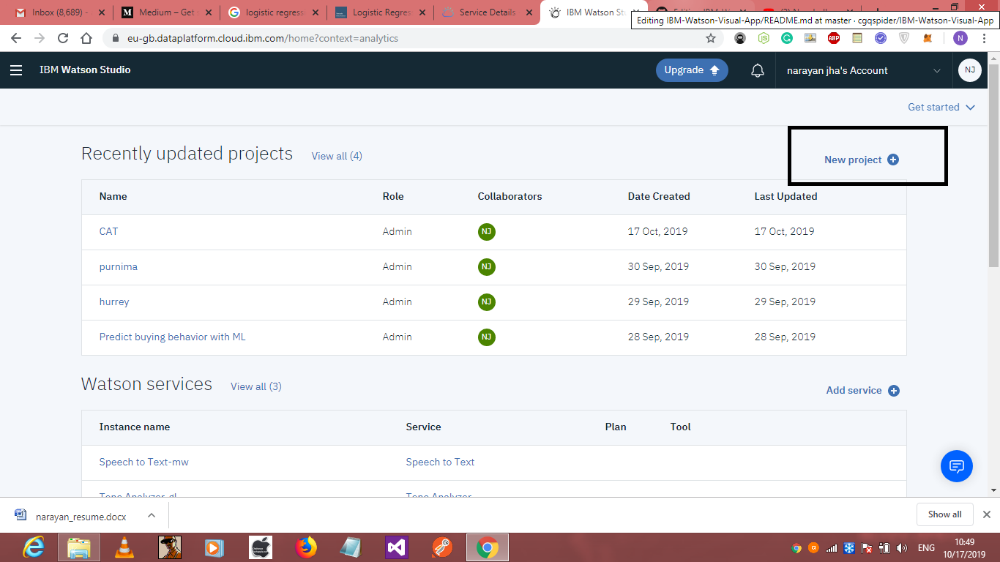
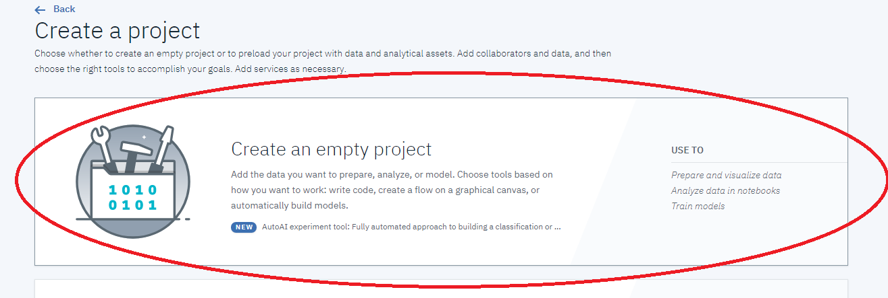
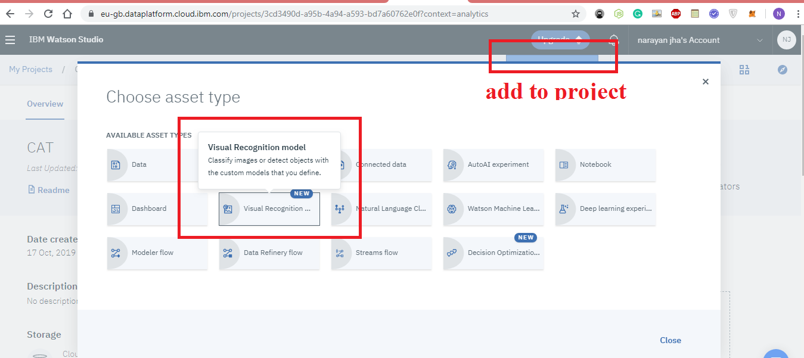
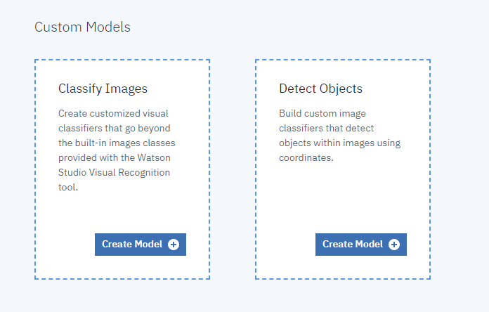
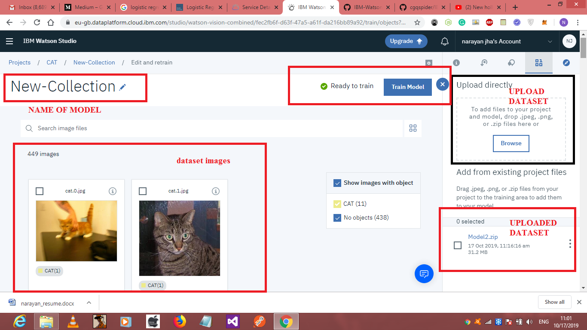
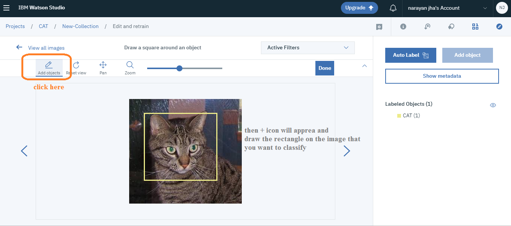
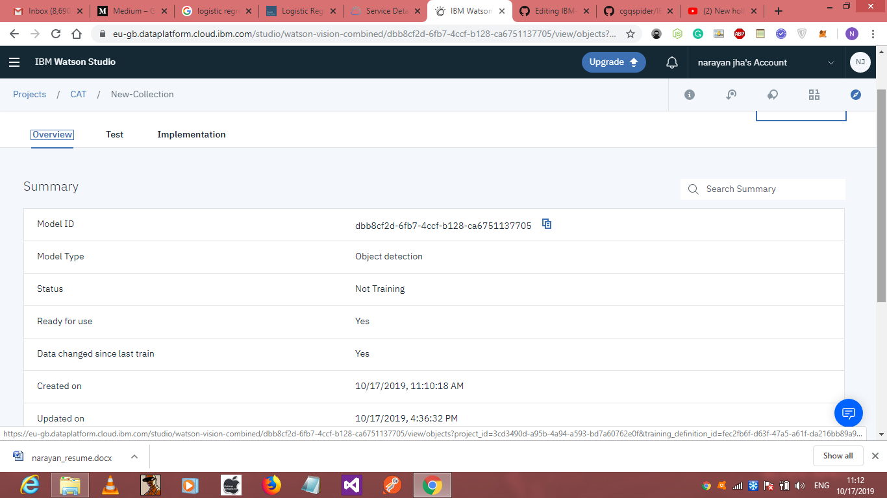

# IBM-Watson-Visual-App
In this project I used the IBM Watson visual api which contains the Image and it gives the all the information about image. Its like Image classifier
1. Create account in IBM WATSON
2. create project in IBM Visual 
3. Get the api and url put inside the index.js
4. npm install package.json to install all the dependencies.
5. Run the project by providing the image in the url in index.js by command: node index.js

# How to make Custom classifier using IBM?
* 1. Create a dataset of images which you want to classify (zip dataset folder)
* 2. Launch a watson studio 

 create a empty project inside that specify the name and description for that project

After than select the project that you created and find add to project icon inside that and select Visual recognition

select type of model you want i used object detection :

Other things are self explorartory

Click on any image and select the classify button 

then select any image and add objects draw the rectangle on that object that you want to recognize do atleast 10 to 15 images and click on train button.
after training a link will appear clickon that and a window will open with summary.

on the test section drop any image and you can test your classifier. Dont forget to give the threshold and use implementation section to get this code :
 
# Analyze image 
Use this code with the visual api key to recognize the specific image in any application 
also provide the image in "image_file=@image.jpg" so that it can classify 
curl -X POST -u "apikey:{apikey}" -F "features=objects" -F "collection_ids=dbb8cf2d-6fb7-4ccf-b128-ca6751137705" -F "images_file=@honda.jpg" -F "images_file=@dice.png" "https://gateway.watsonplatform.net/visual-recognition/api/v4/analyze?version=2019-02-11"

<h2>YOUR CUSTOM CLASSIFIER IS WORKING great</h2>
