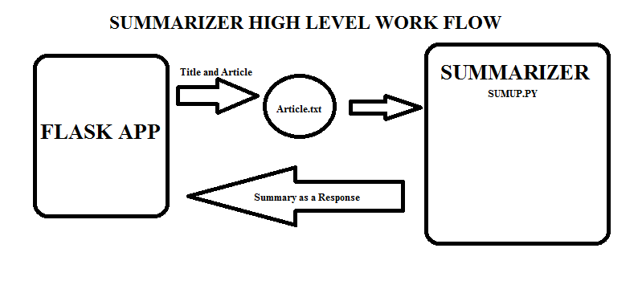

<h1>INTRODUCTION</h1>
This is text summarization app that takes TITLE and ARTICLE as an input and gives the Summary of that article as an input. This project contains two major files which is sumup.py and app.py. sumup.py contains all the code related to the Getting summary of the article which accepts file and the length of the article. On the other hand app.py contains the flask app that acceps the article and title from the UI and sends to the empty file and that file is connected with the sumup.py which again respond back with the Summary which is used to display over the UI.
 

<h1>How to Run?</h1>
It can be done in two steps:
<h4>step 1:</h4> go to project directory (Create Virtualenv) and type (pip install -r requirements.txt) by using this from requirements.txt pip will install all the necessary dependencies.
<h4>step 2:</h4> run the application : python app.py

<h1>Deployement :</h1>
<h5>Just click on deploy button and enjoy the Application</h5>

<h4>Have fun! Good Day</h4> 